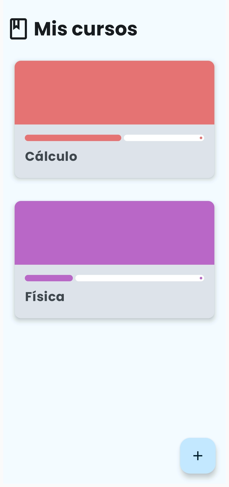
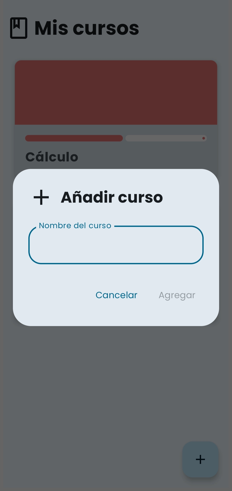
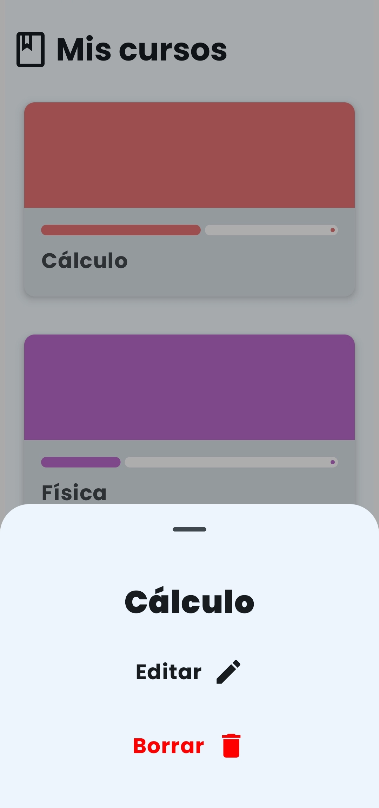
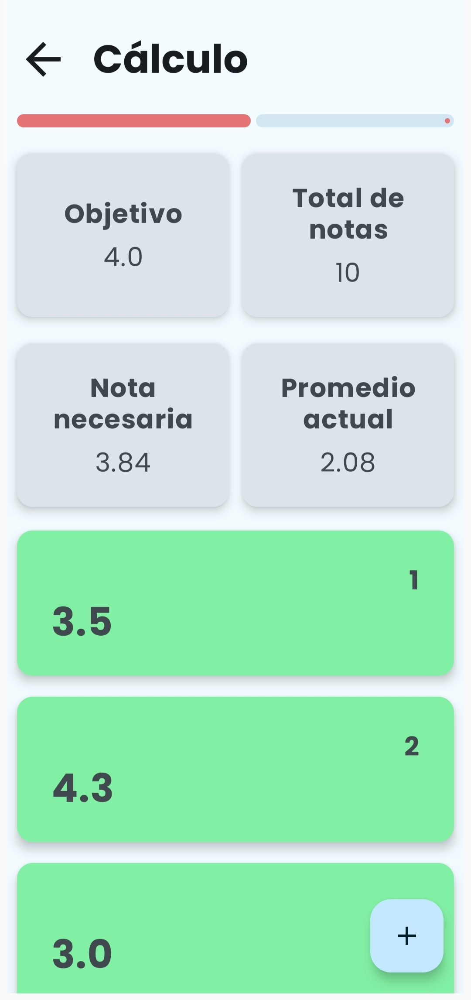
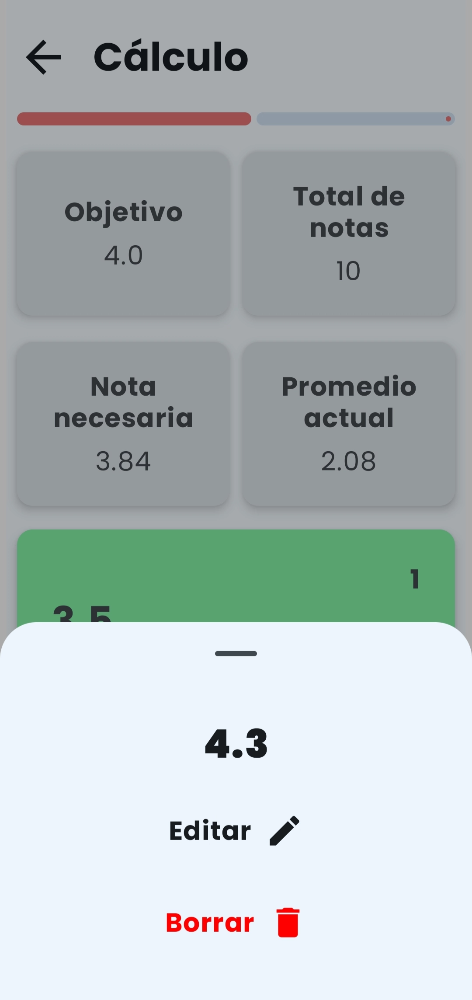

# 📝 Notas - Android App

Aplicación móvil desarrollada en **Android Studio** que permite a los usuarios gestionar notas personales de manera sencilla e intuitiva. Ideal para estudiantes, profesionales o cualquier persona que necesite llevar un registro rápido de ideas o pendientes.

## 📱 Características

- ✅ Crear, editar y eliminar notas
- 🗃️ Organización visual clara y amigable
- 🎨 Interfaz sencilla basada en Material Design usando JetpackCompose
- 💾 Persistencia de datos local

## 🛠️ Tecnologías utilizadas

- **Lenguaje:** Kotlin  
- **Entorno:** Android Studio  
- **Base de datos local:** Room
- **UI:** JetpackCompose

## 📸 Capturas

| Lista de cursos |
|----------------|
|  |

| Añadir curso |
|-------------|
 |

| Menú de curso |
|-------------|
 |

| Lista de notas |
|-------------|
 |

| Menú de nota |
|-------------|
 |


## 🚀 Instalación

1. Clona el repositorio:

   ```bash
   git clone https://github.com/CristianArevaloDuran/Notas-AndroidApp.git
